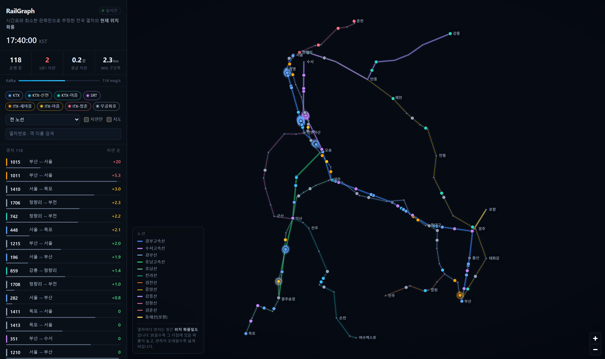
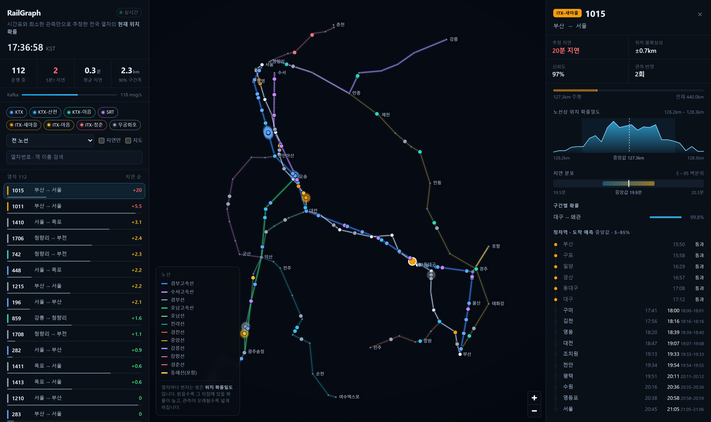
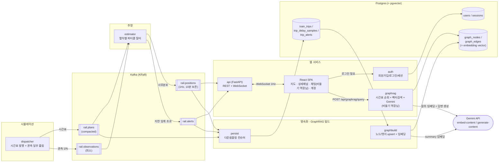
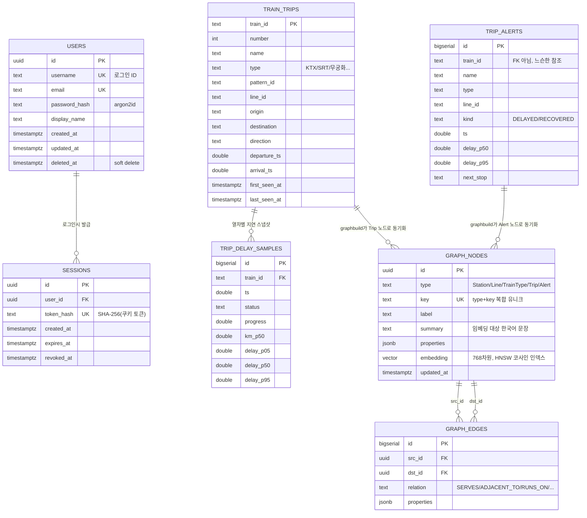

# RailGraph Streaming

전국 열차의 **현재 위치를 확률로** 추정해 실시간으로 흘려보내는 Kafka 파이프라인과 지도 대시보드.

실제 위치는 관측하지 않는다. 관측하는 것은 **시간표**와, 가끔 들어오는 **역 통과 보고**뿐이다.
그래서 미지수는 스칼라 하나 — 그 열차의 현재 지연 — 이고, 위치는 거기서 결정된다.

```
위치(t) = 시간표상_위치(t − 지연)
```

지연을 **파티클 필터**로 추적하고, 파티클 구름을 위 식에 통과시키면 지연 분포가 그대로
**노선 위 위치 분포**가 된다. 지도에 번지는 빛이 바로 그 사후분포다.



---

## 무엇이 실제로 동작하는가

| | |
|---|---|
| 노선망 | 실좌표 98개 역, 12개 노선¹ |
| 열차 | 19개 운행패턴 × 상·하행 = **하루 728편성**, 상시 **110~130편성 운행** |
| 주행시간 | 공표 소요시간 대비 **±15% 이내**(테스트로 고정) |
| 정시율 | KTX 5분 이내 **97.9%**, 무궁화 **93.1%**(실제 통계와 일치) |
| 추정 정확도 | 위치 MAE **0.8km**(관측 반영, 시간표만 쓰면 1.3km) |
| 신뢰구간 | 90% 밴드의 실제 커버리지 **85~91%** |
| 처리량 | 약 **120 msg/s**(편성당 1Hz), 틱당 계산 **~60ms** |

> ¹ 경부·호남고속선, 수서고속선, 경부·호남·전라·경전·중앙·강릉·장항·경춘선, 동해선

---

## 구조

```
dispatcher ──> rail.plans ────────┐
   │           (compacted, 6p)     │
   │                               ├──> estimator ──> rail.positions ──> api ──> WebSocket ──> React
   └────────> rail.observations ───┘       │           (6p, 10분 보존)
              (희소, 3역당 1회)             └────────> rail.alerts
```

**dispatcher** — 철도 운영사 역할. 시간표 전체를 발행하지만, 각 열차의 *실제* 지연은
전체 정차역의 1/3 지점에서만 흘린다. 나머지는 추론의 몫이다. 숨은 진짜 지연은
`train_id`로 시드를 고정해 생성하므로, 재시작해도 같은 진실을 재현한다.

**estimator** — 두 스트림을 열차 키로 조인하는 스트림 프로세서. 열차마다 파티클 필터
하나를 상태로 들고, 매초 현재 시각까지 전진시켜 사후분포 전체를 발행한다.
상태는 오직 로그 재생으로만 복원되므로 프로세스는 언제든 재시작 가능하다.

**api** — 스냅샷을 들고 1초에 한 번 WebSocket으로 팬아웃. 밀도 구간·구간확률·ETA 표
같은 무거운 필드는 **선택된 열차에만** 실어 보낸다. 덕분에 100편성이 초당 1MB가 아니라
약 100KB로 흐른다.

---

## 확률 모델

지연 `D`는 점프-확산 과정을 따른다.

- **회복** — 시간표에는 여유(padding 5.5%)가 들어 있다. 주행 중 지연은 초당 `RECOVERY_RATE`만큼
  깎이되, 0 아래로는 내려가지 않는다. 열차가 크게 일찍 도착하는 일은 없다.
- **확산** — 작은 연속 잡음.
- **사고** — 포아송 도착, 지수분포 크기. 이것이 분포에 **두꺼운 양의 꼬리**를 만든다.
  발생률은 차종 정시율에 비례한다.

역 통과 보고가 들어오면 가우시안 우도로 가중치를 갱신하고, 유효표본수가 절반 아래로
떨어지면 계통 재표집한다. 보고는 **나이를 먹는다** — 센서를 지난 뒤 흐른 시간만큼
확산 분산을 우도에 더해 넓힌다.

```python
position(t) = np.interp(t - particles, plan.profile_t, plan.profile_km)
```

파티클을 시간표 곡선에 통과시키는 이 한 줄이 지연 분포를 위치 분포로 바꾼다.

열차를 고르면 그 사후분포를 그대로 볼 수 있다 — 노선상 위치 확률밀도, 지연의 5~95 백분위,
어느 역간 구간에 있을 확률, 그리고 남은 모든 정차역의 도착 예측 구간.



---

## 전체 아키텍처

스트리밍 추정 파이프라인(위 [구조](#구조))에, 인증이 걸린 웹 대시보드와
Postgres 기반 영속화·GraphRAG 레이어가 얹힌 구조다. Kafka 토픽은 얇고
휘발성이라 `persist`가 다운샘플링해 Postgres로 옮기고, `graphbuild`가 그
위에 지식 그래프를 세우고 임베딩한다.



- **왼쪽 절반(시뮬레이션 → 추정 → Kafka)**은 실시간 지도가 쓰는 저지연 경로다.
  `rail.positions`는 10분만 보존하는 휘발성 스트림이라, 화면을 벗어난 과거는 남지 않는다.
- **오른쪽 절반(persist → graphbuild → Postgres)**은 그 스트림에서 사실을 걸러
  영구 저장하고, 그 위에 지식 그래프를 쌓는 별도 파이프라인이다. 두 절반은
  Kafka 토픽만 공유할 뿐 서로의 실패에 영향받지 않는다 — `persist`가 죽어도
  지도는 그대로 돌고, `api`가 재시작해도 과거 임베딩은 남아 있다.
- **auth**는 나머지 전부와 독립적이다. 대시보드(`/`)와 GraphRAG 질의는
  `require_user` 의존성으로 세션 쿠키를 검사해서 막아둔 것뿐, 인증 자체는
  `users`/`sessions` 테이블 두 개로 끝난다.

---

## 데이터 모델 (ER 다이어그램)



- `users`/`sessions`와 `train_trips`/`trip_delay_samples`/`trip_alerts`,
  `graph_nodes`/`graph_edges`는 **서로 다른 세 서비스**(`auth`, `persist`,
  `graphbuild`)가 각자 만들고 관리하는 별개의 스키마 묶음이다. 외래키로 직접
  엮인 건 각 묶음 내부뿐이고, `train_trips → graph_nodes`처럼 묶음을 가로지르는
  연결은 애플리케이션 레벨에서 `(type, key)`로 조회해 만든다 — 그래서 세
  파이프라인이 서로 스키마 마이그레이션 걱정 없이 독립적으로 진화할 수 있다.
- `graph_nodes`는 `(type, key)`에 유니크 제약을 걸어 두어 `graphbuild`를
  몇 번을 다시 돌려도(재시작, 재배포) 같은 역·노선·운행이 중복 생성되지 않고
  `ON CONFLICT DO UPDATE`로 요약문·속성만 갱신된다.
- `trip_alerts.train_id`는 FK가 아니라 느슨한 참조다 — 알림이 발생한 시점에
  원본 `train_trips` 행이 아직 도착하지 않았을 수 있어(Kafka 순서 보장 X),
  참조 무결성 대신 조회 시점에 없으면 그냥 스킵한다.

---

## 실행

필요한 것: Docker, Python 3.11+, Node 20+.

```bash
python -m venv backend/.venv
backend/.venv/Scripts/python -m pip install numpy aiokafka fastapi "uvicorn[standard]" orjson pytest asyncpg "argon2-cffi" email-validator python-dotenv google-genai pgvector
(cd frontend && npm install && npm run build)
cp .env.example .env   # GEMINI_API_KEY 채워넣기 (https://aistudio.google.com/apikey)
```

```powershell
./scripts/stack.ps1 up
```

Postgres(pgvector 포함) + Kafka(KRaft 단일 브로커) → dispatcher → estimator →
persist → graphbuild → api 순으로 올라간다. `persist`는 스트림을 다운샘플링해
Postgres에 쌓고, `graphbuild`는 그 위에 GraphRAG용 노드/엣지 그래프를 만들고
임베딩한다 (아래 [GraphRAG](#graphrag) 참고).

| | |
|---|---|
| 대시보드 | http://127.0.0.1:8123 (로그인 필요 — 최초 접속 시 회원가입) |
| Kafka UI | http://localhost:8085 |

> Windows에서는 `localhost`가 IPv6 `::1`로 먼저 풀리면서 Docker/WSL 릴레이에
> 가로채이는 경우가 있다. 안 열리면 `127.0.0.1`을 쓸 것.

프런트엔드를 고치는 중이라면 HMR이 붙는 개발 서버를 따로 띄운다.

```bash
cd frontend && npm run dev     # http://127.0.0.1:5273
```

다른 명령:

```powershell
./scripts/stack.ps1 status
./scripts/stack.ps1 logs estimator
./scripts/stack.ps1 topics
./scripts/stack.ps1 down
```

### 테스트

```bash
cd backend && .venv/Scripts/python -m pytest
```

26개 테스트가 시간표 정합성, 실제 소요시간 대비 오차, 정시율 통계, 필터 정확도,
신뢰구간 보정을 검증한다.

---

## 설정

전부 환경변수다.

| 변수 | 기본값(예시) | 뜻 |
|---|---|---|
| `KAFKA_BOOTSTRAP` | `localhost:19092` | 브로커 주소 |
| `RAILGRAPH_API_PORT` | `8123` | API 포트 |
| `RAILGRAPH_TICK_S` | `1.0` | 추정 발행 주기(초) |
| `RAILGRAPH_OBS_EVERY_N_STOPS` | `3` | 관측 간격(정차역 수)¹ |
| `RAILGRAPH_ALERT_DELAY_S` | `300` | 지연 경보 임계(초) |
| `RAILGRAPH_DENSITY` | `1.0` | 배차 간격 배수² |
| `RAILGRAPH_SPEED` | `1.0` | 시뮬레이션 배속³ |
| `DATABASE_URL` | `postgresql://<user>:<password>@<host>:<port>/<db>` | 계정·GraphRAG DB |
| `RAILGRAPH_SAMPLE_INTERVAL_S` | `60` | 지연 스냅샷 저장 간격(초) |
| `RAILGRAPH_GRAPHBUILD_INTERVAL_S` | `30` | 그래프 동기화 주기(초) |
| `RAILGRAPH_EMBED_BATCH` | `20` | 1주기당 임베딩 노드 수⁴ |
| `GEMINI_API_KEY` | *(없음)* | Gemini API 키⁵ |
| `GEMINI_MODEL` | `gemini-flash-lite-latest` | 답변 생성 모델 |

> ¹ 키우면 불확실성이 눈에 띄게 커진다 · ² `0.5`면 열차 수 2배 · ³ 실시간 지도는 `1.0` 유지 ·
> ⁴ 무료 Gemini 쿼터 보호용 · ⁵ `.env`에 `GEMINI_API_KEY=실제_키_값` 형태로 설정 (`.env.example` 참고).
> 없으면 그래프는 만들어지되 임베딩·GraphRAG 질의는 건너뛴다.
>
> `DATABASE_URL`·`GEMINI_API_KEY` 모두 여기 적힌 건 형식일 뿐 실제 값이 아니다 — 로컬 개발용
> 실값은 `docker-compose.yml`/`.env`에 있고 둘 다 git에 커밋되지 않는다.

---

## 회원/인증

로그인해야 대시보드(`/`)에 들어갈 수 있다. `/signup`(아이디·비밀번호·이름·이메일),
`/login`, `/account`(정보 수정·탈퇴)가 있고 세션은 httpOnly 쿠키로 관리한다.
화면 왼쪽 위 "RailGraph" 타이틀을 누르면 홈으로, 오른쪽 위 계정 메뉴에서
회원정보 수정·로그아웃을 할 수 있다.

---

## GraphRAG (비둘기 역장님)

`persist`가 Kafka 스트림(`rail.plans`/`rail.positions`/`rail.alerts`)을 다운샘플링해
Postgres(`train_trips`, `trip_delay_samples`, `trip_alerts`)에 쌓고, `graphbuild`가 그
위에 지식 그래프(`graph_nodes`/`graph_edges`)를 세운다. 
이를 기반으로 웹에서 **"비둘기 역장님"** 이라는 페르소나의 챗봇이 사용자의 질문에 답한다.

- 노드: `Station`(98개역), `Line`(12개노선), `TrainType`(8종), `Trip`(일별 운행),
  `Alert`(지연 경보) — 각 노드는 사람이 읽는 한국어 요약문(`summary`)을 갖는다.
- 엣지: `SERVES`, `ADJACENT_TO`, `RUNS_ON`, `OF_TYPE`, `DEPARTS_FROM`, `ARRIVES_AT`, `RAISED`
- `summary`를 Gemini(`gemini-embedding-001`, 768차원)로 임베딩해 pgvector에 저장한다.

질의는 `POST /api/graphrag/query` (로그인 필요):

```json
{
  "query": "대전역은 어떤 노선이 지나가?", 
  "generate": true, 
  "history": [{"question": "...", "answer": "..."}]
}
```

**검색과 생성의 분리**:
1. **시간표 순회 (정확도 우선)**: "오늘/내일 ... 시간표/경유" 같은 시간표 관련 질문은 벡터 검색을 넘어
   그래프를 순회해 역에 가장 빨리 도착하는 열차(곧 지나갈 열차)부터 정확하게 찾는다.
2. **벡터 검색 (유연성)**: 다른 일반적인 질문은 벡터 유사도로 가장 가까운 노드를 찾는다.
3. 찾은 노드의 1-hop 이웃(그래프 순회)까지 문맥으로 모아 Gemini로 "비둘기 역장님" 스타일의 답을 생성한다.
   `generate: false`면 검색된 사실만 반환한다 (임베딩 쿼터가 없거나 생성이 실패해도 검색 결과는 그대로 온다).

대화 맥락(`history`)을 기억하므로, "그럼 하행은?" 같은 연속된 질문도 자연스럽게 이어갈 수 있다.

---

## 짚어둘 것

- **시간표는 생성한 것이다.** KORAIL/SR의 실제 시간표는 재배포할 수 없어서, 실제 노선과
  실제 정차 패턴에 선로 거리와 차종별 표정속도를 곱해 만들었다. 소요시간이 실제와
  얼마나 맞는지는 테스트가 지키고 있다.
- **관측도 시뮬레이션이다.** dispatcher가 숨은 진짜 지연을 만들고 일부만 흘린다.
  실제 API(국토교통부 TAGO 등)를 붙이려면 `rail.observations`에 같은 스키마로
  넣어주기만 하면 되고, estimator는 손댈 필요가 없다.
- **지도의 빛은 과장이 아니다.** 띠의 길이가 곧 90% 신뢰구간의 실제 길이다. 관측 직후
  열차는 점처럼 좁고, 관측 없이 오래 달린 열차는 눈에 띄게 번진다.

## 코드 구조

```
backend/railgraph/
├── config.py            # 환경변수, 시뮬레이션 시계
├── network.py, network_data.py, geo.py, timetable.py   # 노선망 · 시간표 생성
├── estimation.py        # 파티클 필터
├── bus.py                # Kafka 프로듀서/컨슈머 헬퍼
├── auth.py               # 회원가입/로그인/세션/계정관리 (users, sessions)
├── embed.py               # Gemini 임베딩 · 텍스트 생성 클라이언트
├── graphrag.py             # 시간표 순회 + 벡터검색 + 1-hop 그래프순회 + 답변 생성 (비둘기 역장님)
└── services/
    ├── dispatcher.py      # 시간표 발행 + 관측 시뮬레이션
    ├── estimator.py        # rail.plans+observations -> rail.positions/alerts
    ├── api.py               # FastAPI: REST, WebSocket, 인증 라우터, SPA 서빙
    ├── persist.py            # Kafka -> Postgres 다운샘플링 컨슈머
    └── graphbuild.py          # 지식 그래프 upsert + 임베딩 백필

frontend/src/
├── main.tsx, App.tsx             # 라우팅(react-router-dom), AuthProvider
├── lib/auth.tsx                   # 인증 컨텍스트 + 표준화된 에러 처리
├── lib/feed.ts, types.ts, format.ts # WebSocket 피드, 타입, 포매팅
├── components/                     # MapView, DetailPanel, Sidebar, RagChat, AccountMenu 등
└── pages/                           # Login, Signup, Account
```

각 백엔드 서비스는 `python -m railgraph.services.<name>`으로 단독 실행되는
별도 프로세스이며, `scripts/stack.ps1`이 이들을 한 번에 올리고 내린다.

---

## 스택

Python 3.14 · aiokafka · asyncpg · FastAPI · Apache Kafka 3.9 (KRaft) ·
PostgreSQL 16 + pgvector · Argon2id · Gemini API (embedding-001) ·
React 19 · TypeScript · react-router-dom · MapLibre GL · Vite
